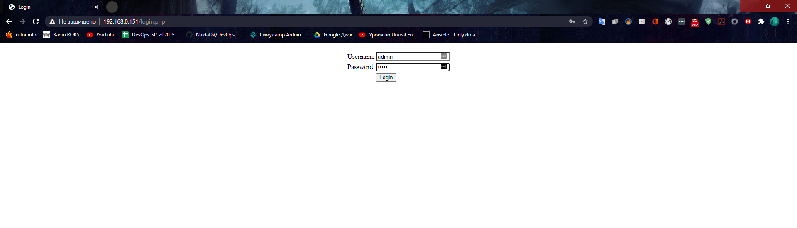
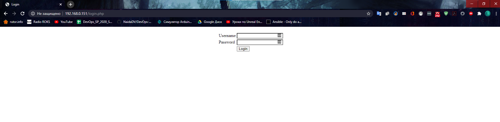
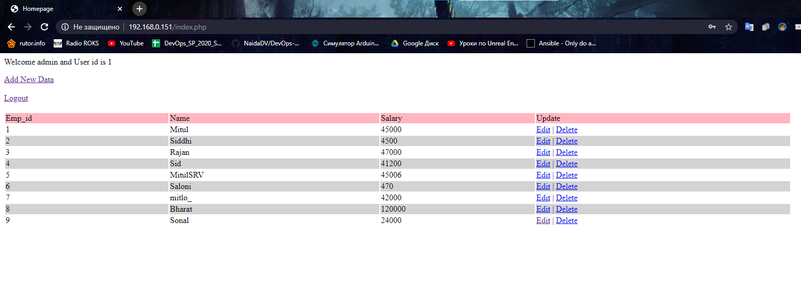
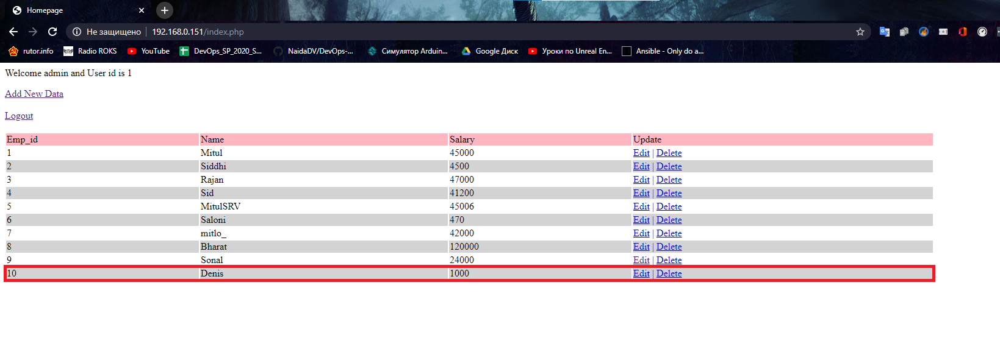
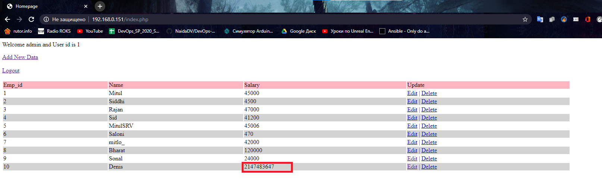
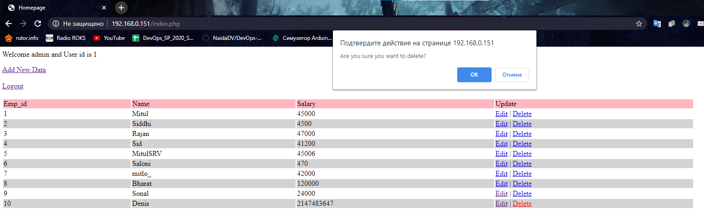

# Homewwork - Ansible
## Workflow
1) Building VMs with Vagrant and VirtualBox
2) Updating and upgrading all VMs
3) Installing sshpass and adding all VMs to Ansible VM known hosts, adding ansible.cnf with instructions - allow using password, not a keys.
4) Writing inventory file and one ansible playbok with all tasks.
5) Testing, debuging.
6) Changing project structure to one with roles.
7) Testing, debuging.
8) Hallelujah! It works:

From nginx loadbalancer:

From it's own IP:

Viewing database:

Adding something:

Changing something

Deleting something

Also homework folder include my Vagrantfile.
